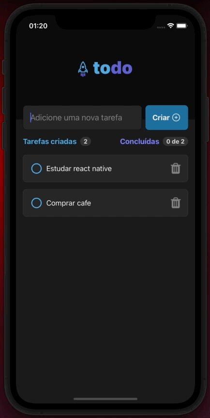
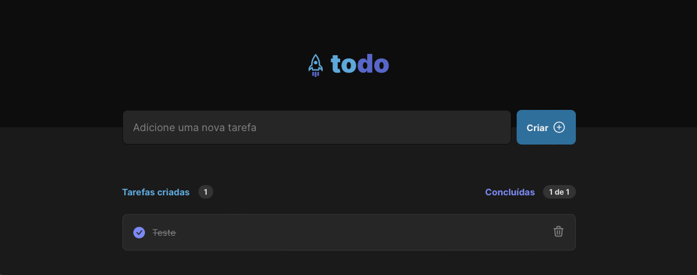

# To-Do List - Versão Mobile

## 📱 Sobre o projeto

To-Do List é um aplicativo para gerenciar uma simples lista de tarefas com opções de criar e apagar um item da lista.
O projeto é uma adaptação de um desafio de desenvolvimento para Web proposto pela [Rocketseat](https://github.com/Rocketseat), foi produzido utilizando conceitos básicos de React Native.

 

### Versão web utilizada como base para o app:



### 🛠️ Ferramentas utilizadas

* Typescript

* Styled Components

<a href="https://www.figma.com/file/0n0zDN7zbzhRbaEO74Xesx/ToDo-List/duplicate" target="_blank">


</a>

## [](https://github.com/eliaslma/todolist-app) 🚀 Como executar o projeto

### Pré-requisitos

Antes de começar, você vai precisar ter instalado em sua máquina as seguintes ferramentas:

[Git](https://git-scm.com), [Node.js](https://nodejs.org/en/) e [Expo](https://expo.dev).

Além disto é bom ter um editor para trabalhar com o código como [VSCode](https://code.visualstudio.com/).

#### 🧭 Rodando a aplicação


```bash

# Clone este repositório

$ git clone https://github.com/eliaslma/todolist-app.git

# Acesse a pasta do projeto no seu terminal/cmd

$ cd todolist-app

# Instale as dependências

$ npm install

# ou

$ yarn

# Execute a aplicação

$ expo start

```

## [](https://github.com/eliaslma) 👨‍🚀 Autor


<a href="https://github.com/eliaslma">

 

 <br />

 <sub><b>Elias Lima da Silva</b></sub></a>

In ☕ We Trust!

Entre em contato:

[](https://www.linkedin.com/in/elias-lima-da-silva-a933a713a/)
[](https://api.whatsapp.com/send?phone=5544997075632&text=Olá!)
[](mailto:sci.eliaslima@gmail.com)

